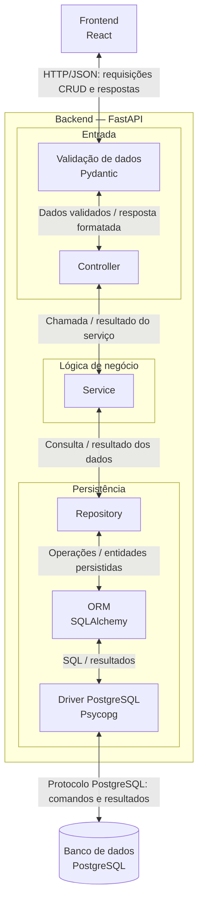

```mermaid
flowchart TB
    frontend["Frontend<br/>React"]

    subgraph backend["Backend — FastAPI"]
        direction LR

        subgraph entrada["Entrada"]
            direction TB
            validation["Validação de dados<br/>Pydantic"]
            controller["Controller"]
        end

        subgraph negocio["Lógica de negócio"]
            service["Service"]
        end

        subgraph persistencia["Persistência"]
            direction TB
            repository["Repository"]
            orm["ORM<br/>SQLAlchemy"]
            driver["Driver PostgreSQL<br/>Psycopg"]
        end
    end

    database[("Banco de dados<br/>PostgreSQL")]

    frontend <-->|"HTTP/JSON: requisições CRUD e respostas"| validation
    validation <-->|"Dados validados / resposta formatada"| controller
    controller <-->|"Chamada / resultado do serviço"| service
    service <-->|"Consulta / resultado dos dados"| repository
    repository <-->|"Operações / entidades persistidas"| orm
    orm <-->|"SQL / resultados"| driver
    driver <-->|"Protocolo PostgreSQL: comandos e resultados"| database
```